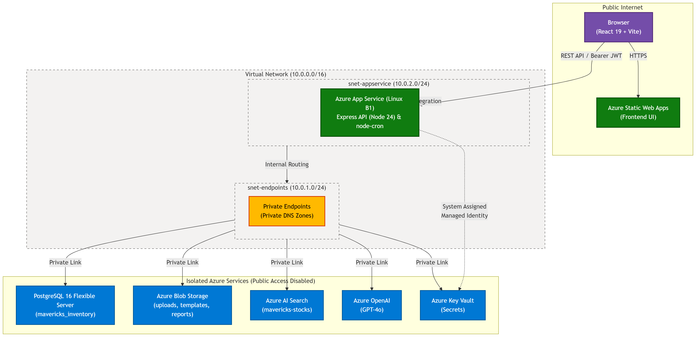
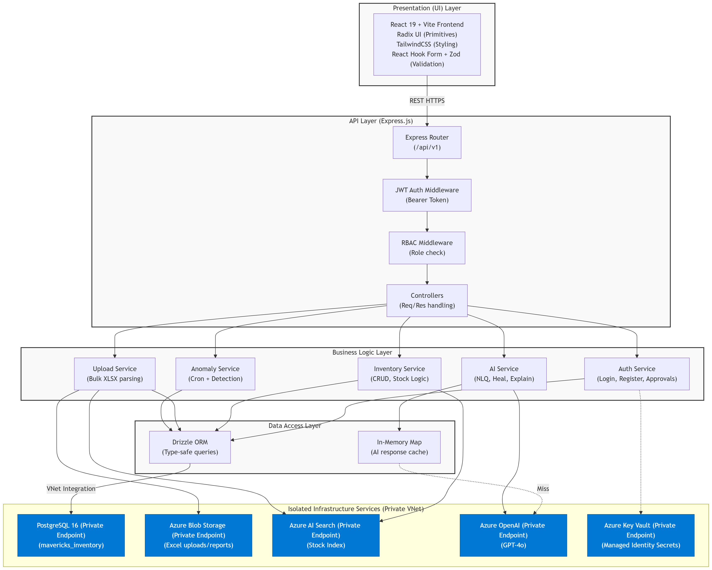
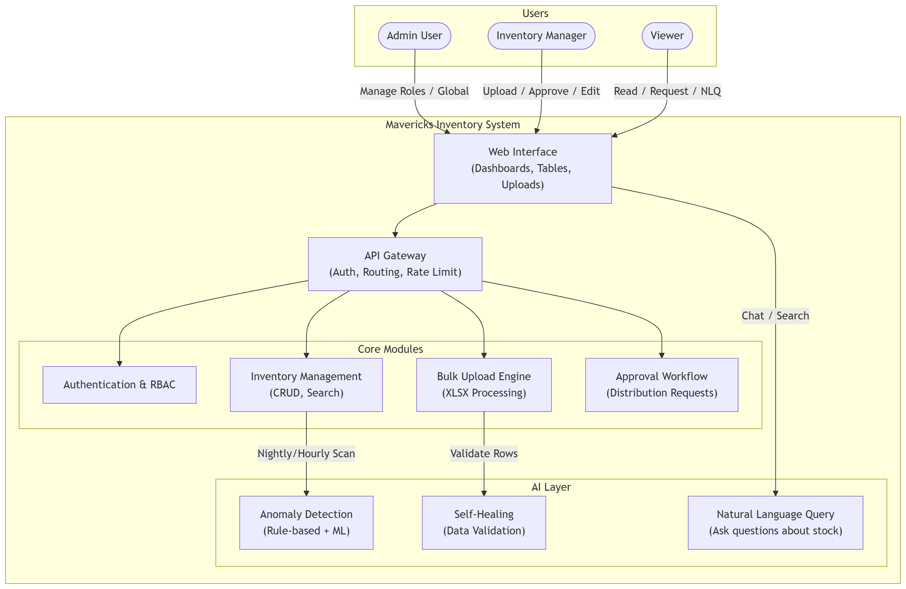
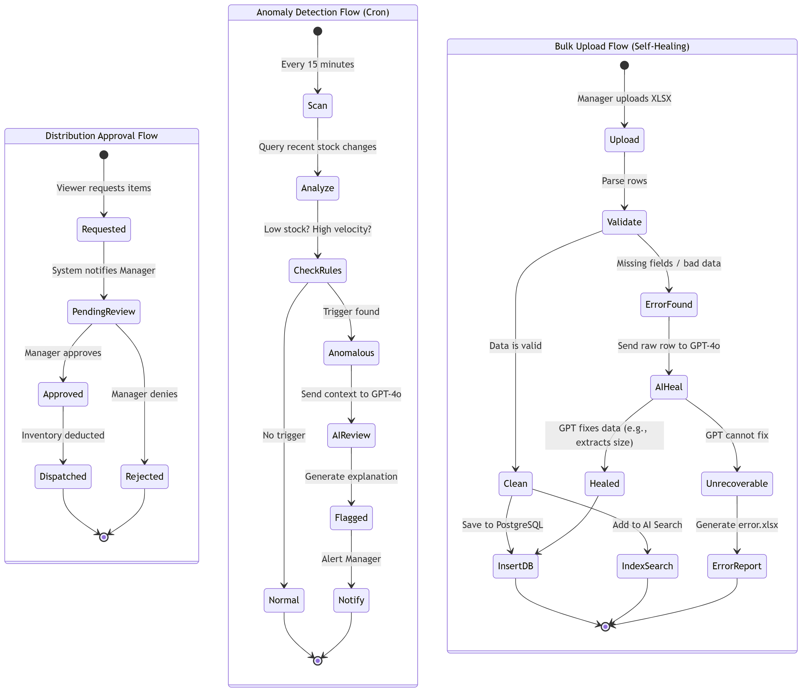
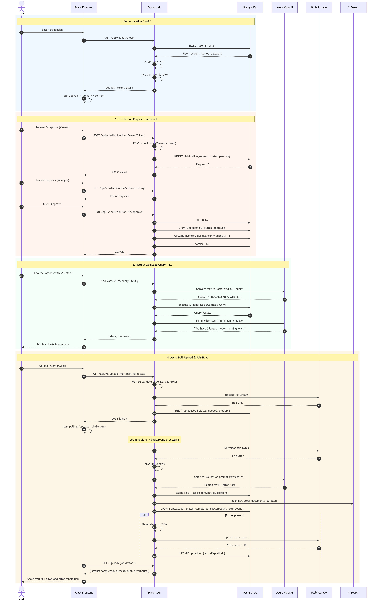
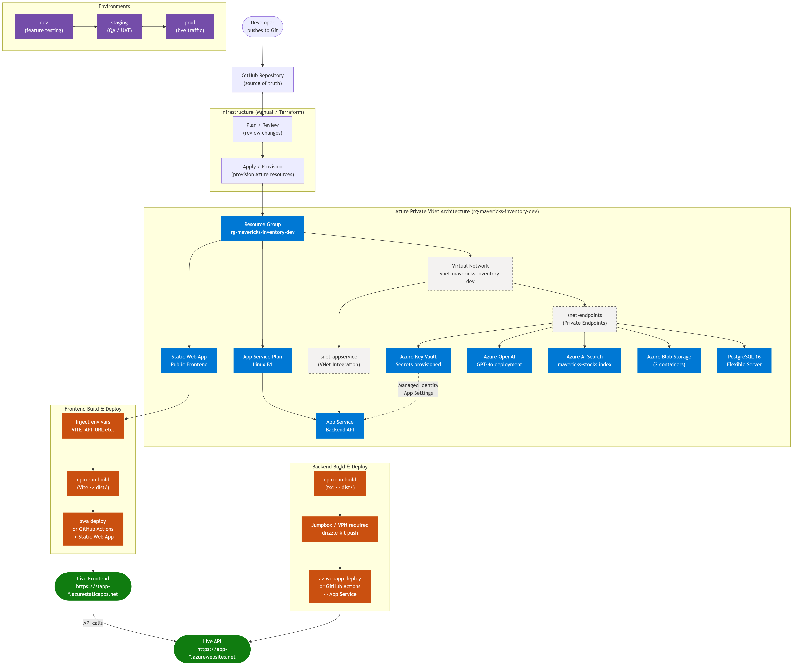
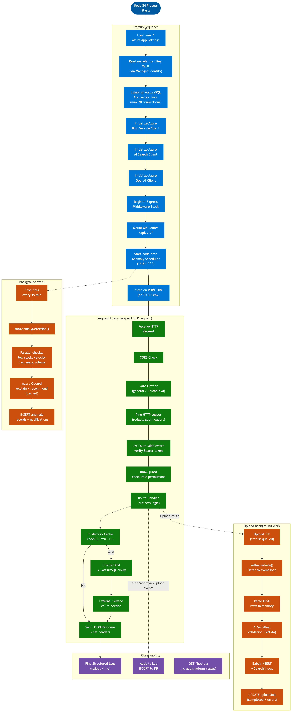

# Mavericks Inventory — Architecture Diagrams

This directory contains the architecture diagrams for the **Mavericks Inventory** system.
Each diagram is maintained as a raw Mermaid syntax document (`.md` file) and has a corresponding rendered image (`.png` file) listed below.

## Quick Reference Table

| # | Diagram | Description | Mermaid Source |
|---|---------|-------------|----------------|
| 1 | [Technical Topology](#1-technical-topology) | Azure infrastructure map with private network topology | [01_technical_topology.md](01_technical_topology.md) |
| 2 | [System Architecture](#2-system-architecture) | Layered system architecture (Presentation to Data) | [02_architecture.md](02_architecture.md) |
| 3 | [Conceptual Flow](#3-conceptual-flow) | High-level user roles, key modules, and the AI intelligence layer | [03_conceptual_flow.md](03_conceptual_flow.md) |
| 4 | [Operational Flows](#4-operational-flows) | Operational workflows: approval, anomaly detection, bulk upload | [04_operational_flows.md](04_operational_flows.md) |
| 5 | [Sequence Diagram](#5-sequence-diagram) | Interaction timelines for auth, distribution, NLQ, and bulk uploads | [05_sequence_diagram.md](05_sequence_diagram.md) |
| 6 | [Publish Flow](#6-publish-flow) | CI/CD pipeline and automated Terraform deployment flow | [06_publish_flow.md](06_publish_flow.md) |
| 7 | [Run Flow](#7-run-flow) | Runtime execution, request lifecycles, and background jobs | [07_run_flow.md](07_run_flow.md) |

---

## Architecture Visualizations

### 1. Technical Topology
**Azure infrastructure map — all services and connections**
This diagram maps out our fully private network architecture, including Virtual Network (VNet), Private Endpoints, Private DNS Zones, and Managed Identities for absolute security in our development environment.

* **Mermaid Source:** [01_technical_topology.md](01_technical_topology.md)
* **Node Target:** Node 24

---

### 2. System Architecture
**Layered system architecture — Presentation to API to Services to Data**
Details the structural layers of the Mavericks Inventory application, illustrating the boundaries, decoupling, and dependencies between the frontend, API gateways, backend services, and database.

* **Mermaid Source:** [02_architecture.md](02_architecture.md)
* **Node Target:** Node 24

---

### 3. Conceptual Flow
**High-level concept flow — user roles, modules, and AI layer**
An abstract view outlining the key user personas, core inventory/distribution modules, and the intelligence layers integrating Azure OpenAI for natural language querying and smart search.

* **Mermaid Source:** [03_conceptual_flow.md](03_conceptual_flow.md)

---

### 4. Operational Flows
**Step-by-step flows: approval workflow, anomaly detection, bulk upload**
Details the execution paths of critical operations within the application, including multi-stage inventory approvals, intelligent anomaly checking, and bulk uploads.

* **Mermaid Source:** [04_operational_flows.md](04_operational_flows.md)

---

### 5. Sequence Diagram
**Time-ordered sequences: auth, distribution approval, NLQ, upload**
An interactive sequence model depicting message exchanges between user sessions, frontend clients, API endpoints, backend databases, and external AI services.

* **Mermaid Source:** [05_sequence_diagram.md](05_sequence_diagram.md)

---

### 6. Publish Flow
**CI/CD and Terraform deployment pipeline**
Illustrates the lifecycle of codebase updates from git commits, security analysis, automated test runs, linting with Node 24, to IaC provisioning via Terraform into Azure's secure network.

* **Mermaid Source:** [06_publish_flow.md](06_publish_flow.md)

---

### 7. Run Flow
**Runtime execution: startup, request lifecycle, background jobs**
Maps the execution behavior during application runtime. Highlights the server boot-up sequence on Node 24, client request execution under authentication guardrails, and key background polling and synchronization routines.

* **Mermaid Source:** [07_run_flow.md](07_run_flow.md)

 |
